# 火车售票系统

## 功能模块

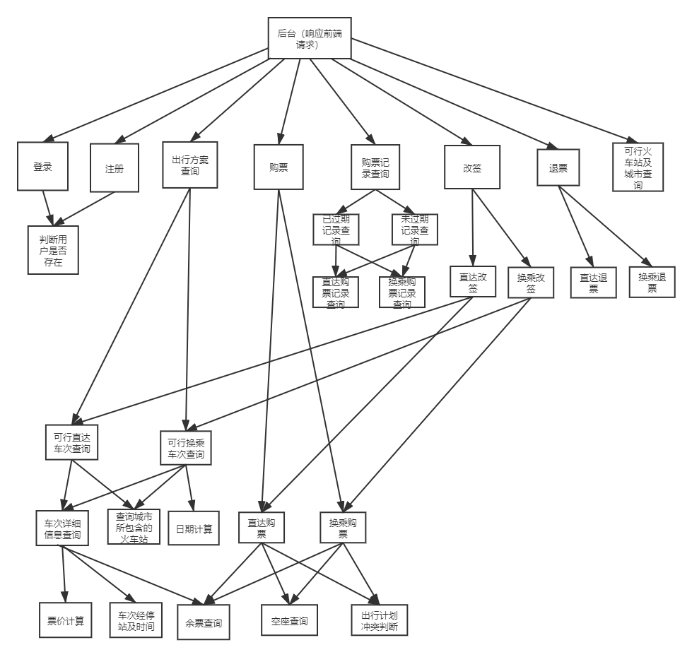

## 界面设计

### 登陆界面

### 方案查询界面

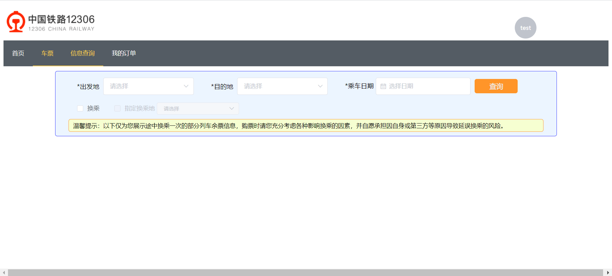

### 查询结果显示界面

#### 直达查询结果显示

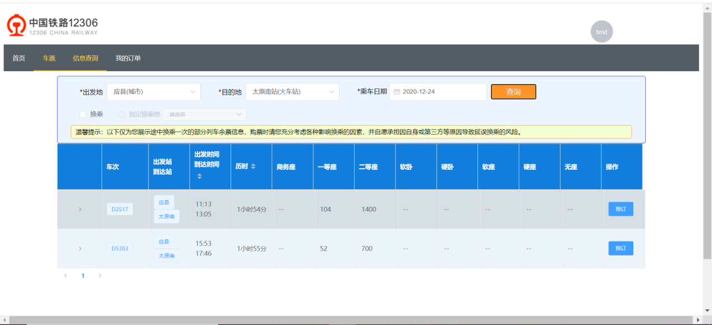

#### 换乘查询结果显示

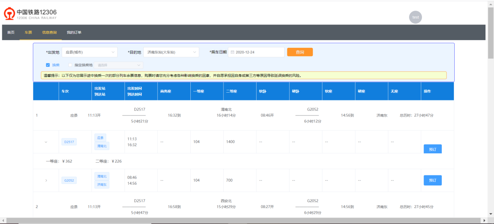

### 购票界面

#### 直达购票界面

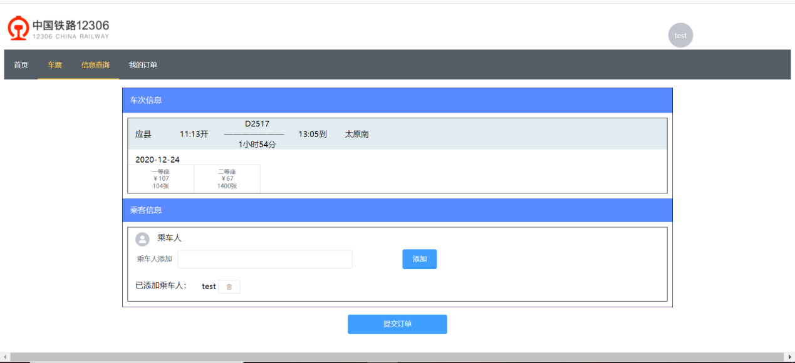

#### 换乘购票界面

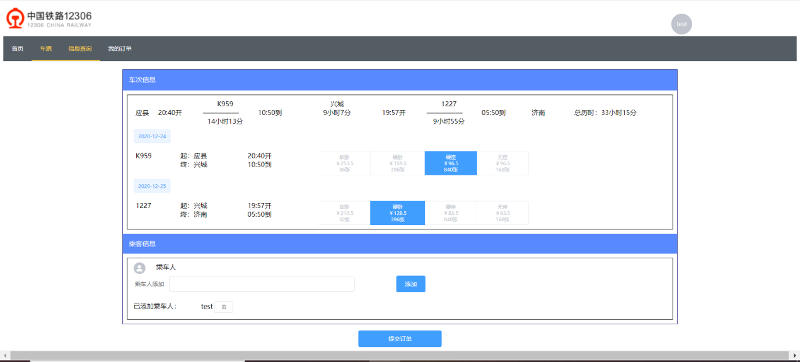

### 购票成功提示

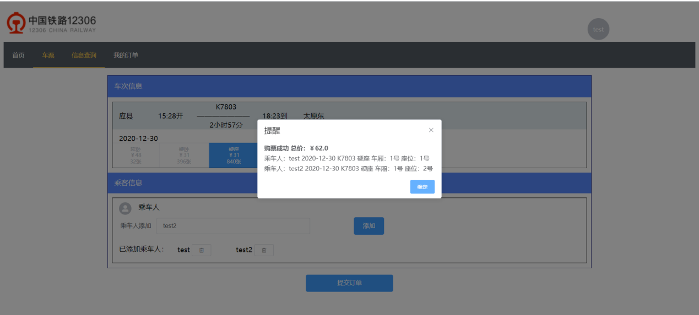

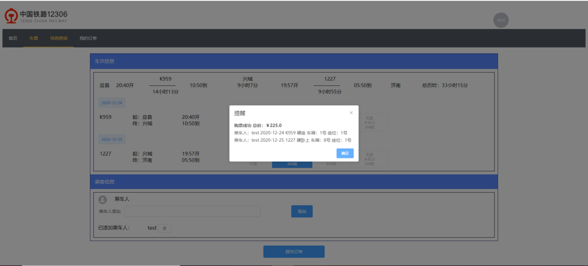

### 购票记录查询界面

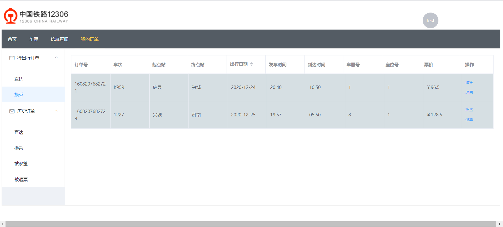

### 改签界面

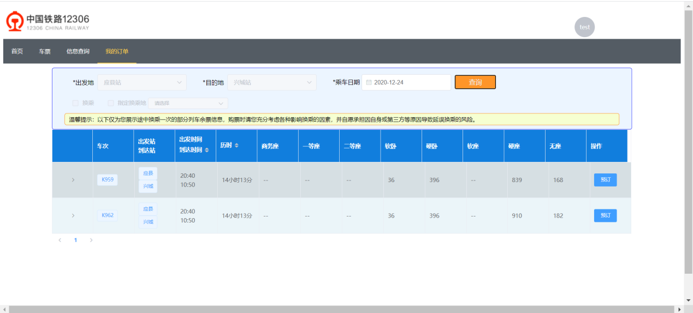

#### 可以选座，但不能增加乘车人

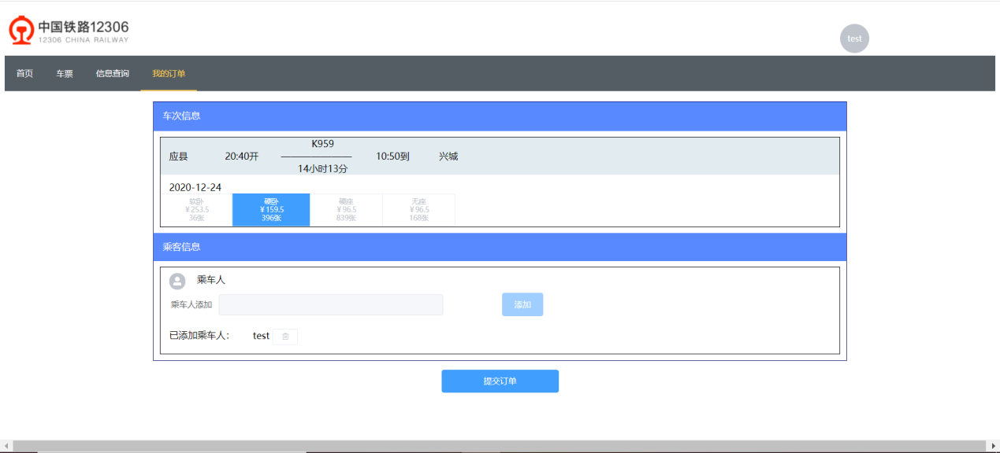
=======
>
